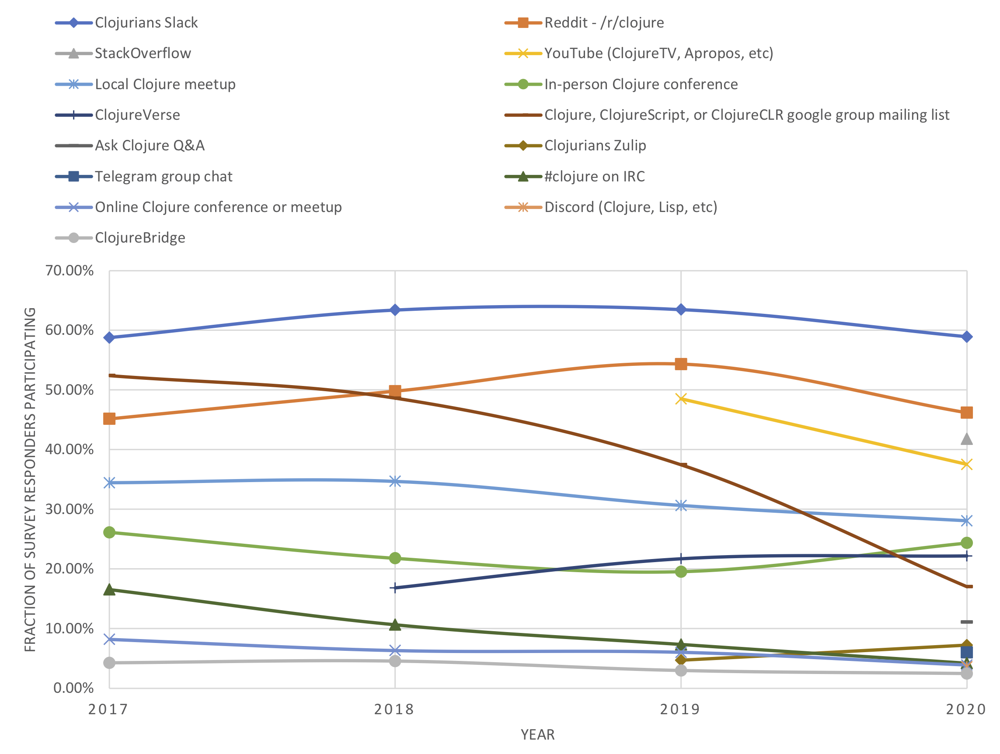

# Why doesn't Clojurians Slack let me search through old messages?

Gavin-John Noonan created the Slack workspace
https://clojurians.slack.com on March 1, 2015.  By the beginning of
2017 (and perhaps earlier), it was already the most popular on-line
chat location for topics related to Clojure development (chart and
data linked below if you are curious).

This Slack community was created via a free plan provided by Slack for
open source communities.  The advantage is that Slack pays for all of
the resources.  A disadvantage is that the free service limits the
searchable message history to the most recent 10,000 messages, total
across all channels.


# Searching the existing logs of Clojurians Slack messages

## clojurians-log

Browse clojurians-log: https://clojurians-log.clojureverse.org

For several channels, the earliest messages recorded in clojurians-log
go back to 2015.  Others start later, e.g. because the channel was
created later, and/or no one started logging the channel on
clojurians-log until later.  There are likely some 'gaps' in the
middle where messages were not being logged.

On Google, you can limit searches to any web site by appending
`site:site-url` to the end of the search, e.g. to search for
occurrences of `defmacro` only on the Clojurians log site, use the
Google search:

```
defmacro site:clojurians-log.clojureverse.org
```

## Clojurians Zulip

The mirroring of many Clojurians Slack channels began on [Clojurians
Zulip Chat](https://clojurians.zulipchat.com/) near the beginning of 2019.

The archive can be found in the [#slack-archive
stream](https://clojurians.zulipchat.com/#narrow/stream/180378-slack-archive).
FOR every mirrored Slack channel there's a separate topic. Very likely
most of your search results will appear in one of those.

To search it (using the browser):
- go to the [#slack-archive stream](https://clojurians.zulipchat.com/#narrow/stream/180378-slack-archive)
- type `/` (or click the magnifying class in the top right)
- append the search terms or string to the query,
  e.g. `stream:slack-archive "cannot be cast to class"`
  - link to results for this example search: [`stream:slack-archive "cannot be cast to class"`](https://clojurians.zulipchat.com/#narrow/stream/180378-slack-archive/search/.22cannot.20be.20cast.20to.20class.22)

You'll see that it yields results from several topics (i.e. Slack
channels) under the `slack-archive` stream.

To see the original conversation that any of the found messages
appeared in, do the following:
- select the message (a thick border will appear around it)
- click the topic (e.g. `slack-archive > beginners`)
- Note: As of 2021-Jan-07, it seems that these steps sometimes get
  you to the message in the context of its conversation, but sometimes
  you end up at a completely different message in the topic.  If you
  experience this, it is not only you it happens for.  This might be a
  bug in Zulip.

Use the back-button to return to the search results.

To search within a specific Slack channel, add `topic:` with the
corresponding name of the channel to the query, e.g.
- `stream:slack-archive topic:beginners "cannot be cast to class"`
- link to results for this example search: [`stream:slack-archive topic:beginners "cannot be cast to class"`](https://clojurians.zulipchat.com/#narrow/stream/180378-slack-archive/search/.22cannot.20be.20cast.20to.20class.22).

As Clojurians Zulip has its own streams where people discuss Clojure
(i.e. ones that are not copies of messages that were sent to
Clojurians Slack), you can also search across _all_ public streams:
- `streams:public "cannot be cast to class"` (note "streams:" not "stream:" here)
- link to results for this example search: [`streams:public "cannot be cast to class"`](https://clojurians.zulipchat.com/#narrow/streams/public/search/.22cannot.20be.20cast.20to.20class.22).

Zulip's help page on advanced search is a good place to read about
more features:
https://clojurians.zulipchat.com/help/search-for-messages


# How to start logging a Clojurians Slack channel

Logging of messages on Clojurians Slack is enabled on a
per-Slack-channel basis, not globally.

First, join the Clojurians Slack channel yourself.  Then send one or
more of these messages to the channel:

+ For Clojurians log: `/invite @logbot`
+ For logging to Clojurians ZulipChat: `/invite @zulip-mirror-bot`

If someone has already successfully invited one of these bots before,
you should see a response like `@logbot is already in this channel`,
and no other human member will see any activity on the channel.

If yours is the first attempt to add one of these bots, then everyone
on the channel including you should see a message like `logbot [APP]
was added to #channel-name`.


# Can we upgrade Clojurians Slack to a paid version?

Yes, someone could choose to pay for this.  If someone chose to do
this, they would be legally responsible to pay the bill to Slack for
_all_ users of Clojurians Slack.  The current pricing as of Jan 2021
puts the bill at somewhere near USD $7,600 per month (with a 50%
discount for the first 3 months).  This amount could change later
based upon Slack's pricing model, but it could also go up or down as
the number of active users of Clojurians Slack changes.  Slack does
not provide a way to bill every user of Clojurians Slack separately
for an equal fraction of that amount.

    2021-Jan-06 snapshot of Clojurians Slack price estimate
    calculation: $8 USD x 952 members x 1 month = $7,616 USD, billed
    monthly.

Given this price, it is perhaps quite understandable that no one has
volunteered to take on such a financial obligation themselves.

Several people have asked whether Slack offers an option where:

+ Individual users could pay a few dollars per month so that _they_
  had access to unlimited search history on Clojurians.slack.com, but
+ everyone else who used it for free would continue to have the
  current limited search history.

As of 2020, Slack does not offer such an option, and they expressed no
interest in doing so.


# Why doesn't everyone switch over to something better?

First, there are many dimensions and aspects to "better", not a single
0 to 10 ranking that captures all judgements of a service that all
people value equally.  Slack has many good qualities.

There are already on-line communities on other services created for
discussing Clojure, e.g. on IRC, Discord, ZulipChat, and several
others.  As of 2021, none of them have reached the popularity that
Slack has.

+ Discord:
  https://www.reddit.com/r/Clojure/comments/6c4z91/a_discord_for_clojurians/
+ Zulip: https://clojureverse.org/t/ann-searchable-slack-archive/3777
+ IRC and some others listed here: https://clojure.org/community/resources

Why doesn't everyone just switch to some other service?

Every individual chooses which of these services they want to use.
They are not limited to one, but few people want to participate in 10
of them simultaneously.  Even if someone is aware of all of them, they
are likely to choose one, or perhaps two or three, that they find to
give them a good UI experience, and more importantly, where _others
respond to their questions_.  So far, Slack has been the most popular
place for Clojure developers.  Yes, there is a network effect here:
https://en.wikipedia.org/wiki/Network_effect

Could the current situation ever change?  Of course it could.  But
there is no "Clojure dictator for on-line chat" that can make all of
these individuals use a different service.  Think like a politician in
a free society, or a sales person, not like a monarch issuing decrees,
and you might find a way to persuade many people to switch services.
Keep this in mind: merely because _you_ think service X is clearly
superior to Slack, that fact alone is unlikely to convince people to
join service X and stop using Slack.  It is still unlikely, even if
you have a well written article detailing all the ways that X is
better than Slack.  Even if you find many people who agree with your
article.

IRC was the most popular on-line chat forum for Clojure for several
years, and then the majority of people gradually changed their primary
choice to Slack.  No one forced everyone to switch, and IRC is still
used by a few people for discussing Clojure.

The Clojurians Slack channel #community-development is the most
appropriate place on Slack to discuss this.  It has been discussed
several times per year for several years, so please realize that it is
not trivial to come up with a novel idea in this area.


# State of Clojure Survey results for ecosystem involvement

The State of Clojure Survey has had a little over 2,000 responders
(i.e. people who choose to fill out the questionnaire) from 2016
through 2020.  The results for all questions can be found here:
https://clojure.org/news/2020/02/20/state-of-clojure-2020

The chart below shows the percentage of people who responded to the
question "My involvement in the Clojure ecosystem includes".  The
first survey year shown is 2017, since the results were published in
Jan 2017, but it is from the State of Clojure 2016 survey results,
probably called that since the questionnaire was sent out and
responded to late in 2016.


